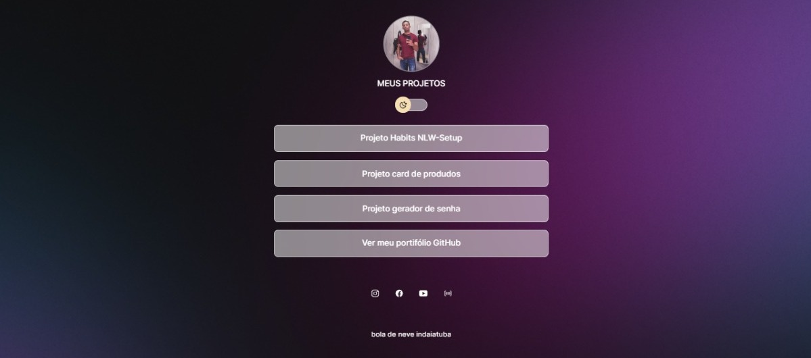

# <h1 align="center">Projeto<h1 align="center"> Links </h1>

 
Programa exclusivo com todos os meus projetos WEB.  

  

 

## 🚀 Tecnologias

Esse projeto foi desenvolvido com as seguintes tecnologias:

## 💻 Projeto

Este projeto contem os links  dos projetos feito em estudos 

- [Acesse o projeto finalizado, online](https://reh22.github.io/projeto/)

